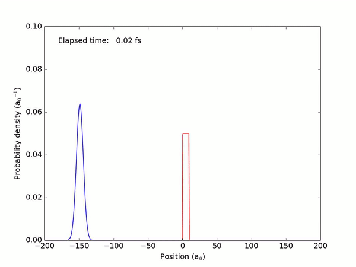

# Quantum-Tunneling
Introduction:

This code is a simulation of a wave packet passing through a potential barrier. The simulation uses the Crank-Nicolson method to solve the time-dependent Schrödinger equation and matplotlib for animation. 

Results:

The program will output the wavefunction solution to the Schrödinger equation for the specified potential and boundary conditions. The wavefunction solution can be visualized using a plot generated with Matplotlib.

Plot:

